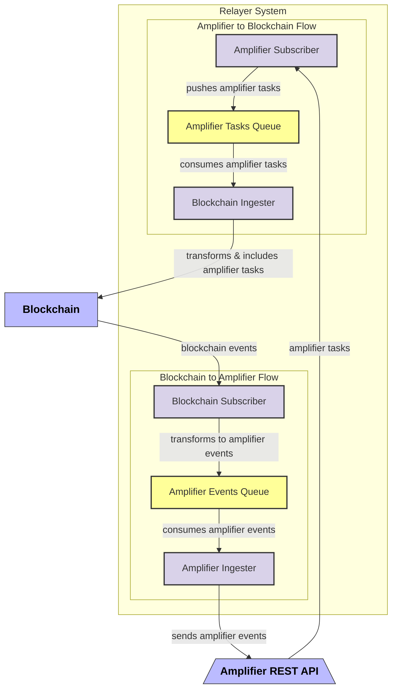

# Axelar Relayer core libraries
This repo provides building blocks for Axelar<>Blockchain Relayer

## Relayer Architecture Overview

## Bidirectional Flow Architecture

The relayer establishes bidirectional communication between an Amplifier API and a blockchain. It consists of these main flows:

### Amplifier to Blockchain Flow
- **Amplifier Subscriber**: Subscribes to the Amplifier REST API and receives amplifier tasks
- **Amplifier Tasks Queue**: Stores tasks before processing
- **Blockchain Ingester**: Consumes tasks from the queue, transforms them to a compatible format, and includes them in the blockchain

### Blockchain to Amplifier Flow
- **Blockchain Subscriber**: Subscribes to blockchain events 
- **Amplifier Events Queue**: Stores transformed events
- **Amplifier Ingester**: Consumes events from the queue and sends them to the Amplifier API

## Internal Relayer Architecture

The relayer uses threading and supervision model:

1. **Supervisor**:
   - Runs on its own dedicated thread with a Tokio runtime
   - Spawns and monitors worker threads only for the components selected via CLI
   - Detects crashes and automatically restarts failed components
   - Provides a graceful shutdown period when termination is requested

2. **Termination Handling**:
   - A dedicated thread listens for Ctrl+C signals
   - Uses an AtomicBool as a shared termination flag
   - When Ctrl+C is received, the AtomicBool is set to true
   - All components, including the supervisor, watch this AtomicBool
   - Upon termination, components have graceful period to finish current work

3. **Worker Components**:
   - Each component (Amplifier Subscriber, Blockchain Ingester, Blockchain Subscriber, Amplifier Ingester) runs on its own thread
   - Each thread has an isolated Tokio runtime
   - Components check the termination flag regularly and shut down when needed
   - Isolation ensures a failure in one component doesn't affect others
   - It's up to the implementation to run all components at once or as separate binaries but isolation is mandatory

4. **Queue Abstraction**:
   - All access to queues is abstracted via Rust traits
   - Currently implemented using [NATS](https://nats.io/) open-source messaging system
   - Abstraction allows for easy replacement with different queue technologies
   - Components interact with queues only through trait interfaces, maintaining loose coupling
   - Supports horizontal scaling by allowing multiple instances to consume from the same queue

## WorkerFn Array
Since `WorkerFn` is pointer to async function pushing data to hashmap is queite noisy.

check [Example](crates/amplifier-components/examples/components_array.rs)
