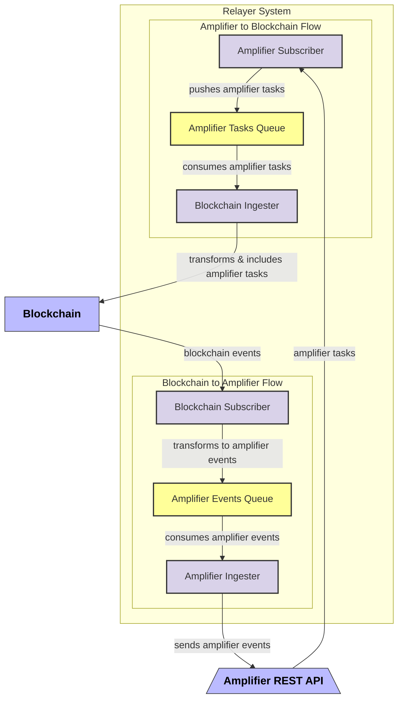

# Axelar Relayer core libraries

This repo provides building blocks for Axelar<>Blockchain Relayer

## Relayer Architecture Overview



## Bidirectional Flow Architecture

The relayer establishes bidirectional communication between an Amplifier API and a blockchain. It consists of these main flows:

### Amplifier to Blockchain Flow

- **Amplifier Subscriber**: Subscribes to the Amplifier REST API and receives amplifier tasks then sends them to queue
- **Amplifier Tasks Queue**: Stores amplifier tasks
- **Blockchain Ingester**: Consumes tasks from the queue, transforms them to a compatible format, and includes them in the blockchain

### Blockchain to Amplifier Flow

- **Blockchain Subscriber**: Subscribes to blockchain events, transforms them into amplifier events and sends to queue
- **Amplifier Events Queue**: Stores amplifier events
- **Amplifier Ingester**: Consumes events from the queue and sends them to the Amplifier API

## Internal Relayer Architecture

The relayer is designed as 4 components: 2 ingesters & 2 subscribers - 1 for each chain (Axelar/amplifier API and the connecting chain)

1. **Supervisor**(optional):

   - Runs on its own dedicated thread with a Tokio runtime
   - Spawns and monitors worker threads only for the components selected via CLI
   - Detects crashes and automatically restarts failed components
   - Provides a graceful shutdown period when termination is requested
   - Is fully optional

2. **Termination Handling**:

   - A dedicated thread listens for Ctrl+C signals
   - Uses an CancellationToken as a shared termination flag
   - When Ctrl+C is received, the CancellationToken is set to true
   - All components, including optional supervisor, watch this CancellationToken
   - Upon termination, components have graceful period to finish current work

3. **Worker Components**:

   - Each component (Amplifier Subscriber, Blockchain Ingester, Blockchain Subscriber, Amplifier Ingester) runs isolated
   - Components check the termination flag regularly and shut down when needed
   - Isolation ensures a failure in one component doesn't affect others
   - It's up to the implementation to run all components at once (and isolate via supervisor) or as separate binaries

4. **Queue Abstraction**:
   - Queue is push based
   - Currently implemented using [NATS](https://nats.io/) and [GCP](https://cloud.google.com/pubsub?hl=en)
   - Abstraction allows for easy replacement with different queue technologies
   - Components interact with queues only through trait interfaces, maintaining loose coupling
   - Supports horizontal scaling by allowing multiple instances to consume from the same queue

The supervisor is optional, and each component can be started as a separate binary.

## Running the Components

### Configuration

Before running the components, you need to create a configuration file. An example configuration file is provided in `relayer-config-example.toml`. You can copy this file and modify it according to your needs:

```bash
cp relayer-config-example.toml relayer-config.toml
```

Edit the `config-example.toml` file to configure:

- Amplifier API configuration (notably your chain name)
- Backend configuration (NATS or GCP Pub/Sub)
- Tickrate for processing events
- Health check endpoints

Config file is fully optional and app could be configured via env vars with prefix `RELAYER_`


### Running Amplifier Ingester

```bash
# Build the ingester
cargo build --bin amplifier-ingester

# Run with default config path (looks for relayer-config.toml in current directory)
./target/debug/amplifier-ingester

# Or specify a custom config path
./target/debug/amplifier-ingester --config /path/to/your/config.toml
```

### Running Amplifier Subscriber

```bash
# Build the subscriber
cargo build --bin amplifier-subscriber

# Run with default config path (looks for relayer-config.toml in current directory)
./target/debug/amplifier-subscriber

# Or specify a custom config path
./target/debug/amplifier-subscriber --config /path/to/your/config.toml
```

### Running with Specific Backend

By default, both components are built with GCP support. To use NATS as the backend, compile with the `nats` feature:

```bash
# Build with nats backend support
cargo build --bin amplifier-ingester --features nats --no-default-features
cargo build --bin amplifier-subscriber --features nats --no-default-features
```

### Health Checks

Once running, you can check the health of the components by sending an HTTP request to the configured health check endpoints:

```bash
# Check health of a component (assuming default port 8080)
curl http://localhost:8080/healthz

# Check readiness of a component
curl http://localhost:8080/readyz
```

## Docker Deployment

The Axelar Relayer Core components can be containerized using Docker. Dockerfiles are provided for both the amplifier-ingester and amplifier-subscriber components.

### Building Docker Images

To build the Docker images:

```bash
# For the ingester with default backend (GCP)
docker build -t axelar-amplifier-ingester -f crates/amplifier-ingester/Dockerfile .

# For the subscriber with default backend (GCP)
docker build -t axelar-amplifier-subscriber -f crates/amplifier-subscriber/Dockerfile .
```

### Using NATS Instead of GCP

You can build with NATS support instead of the default GCP by using build arguments:

```bash
# Build with NATS backend
docker build -t axelar-amplifier-ingester-nats \
  --build-arg FEATURES=nats \
  -f crates/amplifier-ingester/Dockerfile .

docker build -t axelar-amplifier-subscriber-nats \
  --build-arg FEATURES=nats \
  -f crates/amplifier-subscriber/Dockerfile .
```

### Running Docker Containers

To run the containers, you'll need to provide your configuration file:

```bash
# Run the ingester
docker run -p 8080:8080 -v /path/to/your/relayer-config.toml:/app/relayer-config.toml axelar-amplifier-ingester

# Run the subscriber
docker run -p 8081:8080 -v /path/to/your/relayer-config.toml:/app/relayer-config.toml axelar-amplifier-subscriber
```

By default, the health check endpoints will be available at:

- http://localhost:8080/healthz and http://localhost:8080/readyz for the ingester
- http://localhost:8081/healthz and http://localhost:8081/readyz for the subscriber (mapped to a different host port to avoid conflicts)

### Environment Variables

You can override configuration options using environment variables when running Docker containers:

```bash
docker run -p 8080:8080 \
  -v /path/to/your/relayer-config.toml:/app/relayer-config.toml \
  -e "TICKRATE_SECS=10" \
  -e "NATS_URLS=nats://nats-server:4222" \
  axelar-amplifier-ingester
```

### Docker Compose

The project includes dedicated Docker Compose files for both GCP and NATS backends:

- `docker-compose.gcp.yaml` - For running with GCP (default) backend
- `docker-compose.nats.yaml` - For running with NATS backend

#### Using the GCP Backend

To run the components with GCP as the backend:

```bash
# First ensure you have a configuration file
cp relayer-config-example.toml relayer-config.toml

# Edit the relayer-config.toml to configure your GCP settings
# Make sure your GCP configuration is properly set in the [gcp] section

# Start all services using the GCP compose file
docker compose -f docker-compose.gcp.yaml up -d

# Check the status of the services
docker compose -f docker-compose.gcp.yaml ps

# View the logs
docker compose -f docker-compose.gcp.yaml logs -f
```

For GCP, you may need to provide authentication credentials by uncommenting the relevant volume mounts and environment variables in the Docker Compose file.

#### Using the NATS Backend

To run the components with NATS as the backend:

```bash
# First ensure you have a configuration file
cp relayer-config-example.toml relayer-config.toml

# Edit the relayer-config.toml to configure your NATS settings
# Make sure your NATS configuration is properly set in the [nats] section

# Start all services using the NATS compose file
docker compose -f docker-compose.nats.yaml up -d

# Check the status of the services
docker compose -f docker-compose.nats.yaml ps

# View the logs
docker compose -f docker-compose.nats.yaml logs -f
```

The NATS server exposes:

- Port 4222 for client connections
- Port 8222 for HTTP monitoring

The ingester and subscriber configuration automatically connects to the NATS server using the internal Docker network.

#### Stopping Services

To stop the services:

```bash
docker compose -f docker-compose.<backend>.yaml down
```

Where `<backend>` is either `gcp` or `nats`.
